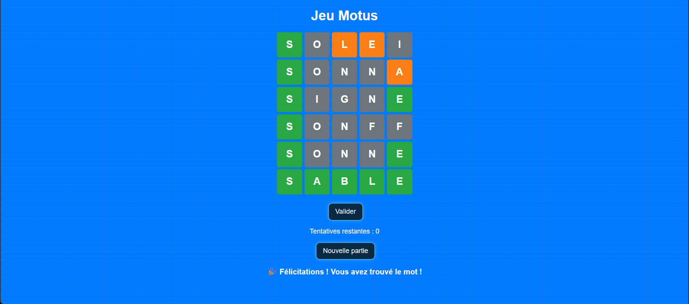

# Motus Game
A word-guessing game inspired by **Motus/Wordle**, developed with **JavaScript**, **HTML**, and **CSS**.  
The goal is to guess a 5-letter word in **6 attempts maximum**. The first letter of the word is revealed to help the player.


## 🖼️ Game Preview

  
*The first letter is revealed, and colors indicate letter accuracy.*


## 📝 Features

✔️ Random word selected from a predefined list  
✔️ First letter revealed automatically  
✔️ Input via keyboard or click interface  
✔️ 6 attempts per game  
✔️ Dynamic victory or defeat messages  
✔️ Button to start a new game  


## 📂 Available Words

```javascript
const words = [
  "POMME","ARBRE","CHAIR","LIVRE","FLEUR","TIGRE","ROUGE","TABLE",
  "PLAGE","NEIGE","JOUER","BRUIT","PETIT","CHANT","FORCE","GRACE",
  "NUAGE","ECRAN","ROUTE","SABLE","AMOUR","NAGER","BOITE","POIRE",
  "SONNE","VILLE"
];

## Usage / How to run

Option 1 — Open locally:

- Open `index.html` in your browser (double-click or drag-and-drop).


